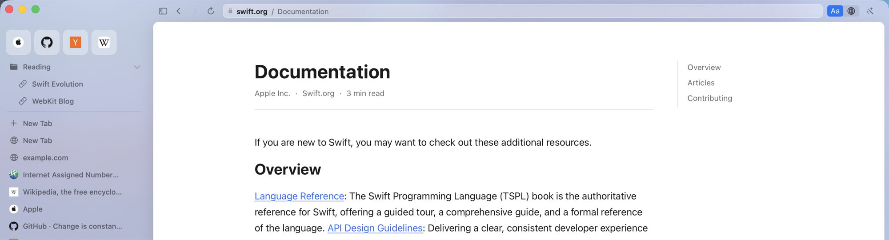

# Zentic

A browser where the clean version of a page **is** the page you land on.

Reader modes exist, but they are an escape hatch: opt-in, per-page, and they mangle
anything that is not a plain article. Zentic inverts the default. The page is
stripped, restructured and re-rendered in its own design system before you see it,
and the original is always one keystroke away.

macOS and iOS, Swift, WKWebView. Same renderer as Safari — no engine fork, no CVE
treadmill.



*swift.org, restructured. Sidebar tabs on frosted glass, breadcrumb address bar,
and the five-stop level rail at top right.*

---

## Three layers

| Layer | What it does | Cost per page |
|---|---|---|
| **Strip** | Blocks ads and trackers, dismisses cookie walls | Zero — declarative rules in the network process |
| **Restructure** | Extracts the real content and re-renders it | Zero — deterministic, no model involved |
| **Redesign / Rewrite** | Generates the look, or re-voices the prose | A model call, only when you ask |

The architectural point is that layers 1 and 2 need **no model calls at all**. AI
appears in exactly two places you choose to invoke: generating a design for a site
(once, then cached), and rewriting prose on sites you have pinned to it. The common
path is free, instant, offline and private.

## One control

The three layers used to be reached through three unrelated widgets, and the strip
layer had no control at all — so the question that matters on any page had nowhere
to be answered: *how much is this browser changing what I am looking at?*

That is now a single five-stop rail in the toolbar, per site, with defaults inferred
per page rather than guessed once.

| Stop | What it does |
|---|---|
| **Original** | The site exactly as it shipped |
| **Clean** | Ads and trackers blocked; the site's own layout, untouched |
| **Calm** | Also the interstitials and the chum, and cookie walls answered |
| **Reader** | Rebuilt in Zentic's type and spacing — every word still the publisher's |
| **Rewritten** | Also re-voiced by a model. Badged, gated, one keystroke from the original |

The ladder is strictly ordered, and the order is load-bearing: each stop does
everything the one below it does and one thing more, which is what makes a slider an
honest control for it. `ShieldState` and `ReaderMode` are projections of the level
rather than separately settable — two controls that can disagree are two controls
that will.

Moving between Calm, Reader and Rewritten is instant. Changing what is *blocked*
reloads, because WebKit bakes `css-display-none` into a document at load and a
request already on the wire cannot be recalled. The rail says which is which before
you click.

**Smart defaults, not a remembered guess.** A site is not one kind of page — a
registrar's front door is marketing and its blog is prose — so the default is
resolved per page from the archetype, and a site can be left on `Automatic`, pinned
to a level, or capped (`never above Calm`). Choosing the level a page would have
picked anyway is stored as automatic, not as a pin, so it isn't frozen there when the
site changes.

**Rewritten is persistent, and it is the one stop that carries consent.** Pinning a
site to it is standing consent for that origin — its pages are re-voiced on every
visit, because a control reading "Rewritten" over prose nobody rewrote is a control
lying about the page. It is never reached automatically: only an explicit pin gets
you there, and news, medical, legal and financial pages still ask every time.

**Design is a separate axis.** Presentation is lossless and reversible; tone changes
what the words say. Conflating them would mean crossing a consent boundary while
picking a font, so themes live in their own menu — six built-in looks, or describe
one and a model returns validated tokens, never CSS.

The prompt opens with suggestions drawn from what the page turned out to be, because
a blank field is a bad way to ask for a design: a reference page wants a tight
measure and legible code, an essay wants the opposite, and neither wants what the
other wants. Pick one and edit it, or ignore them and write your own.

## Performance

Measured against Safari on the same machine, same 30 origins, both from cold and
both allowed to settle. Reproduce with `ZenticMac --stress 30`.

| | Zentic | Safari |
|---|---|---|
| Warm launch → window | **≈430 ms** | ≈2550 ms |
| RAM, 30 sites, settled | **530 MB** | ≈1096 MB |
| Helper processes | **15** | ≈37 |

Zentic wins on memory because it suspends: beyond `Budget.maxLiveWebViews` (8),
least-recently-used tabs drop their web view and keep a snapshot plus restorable
state. That is a real trade — Safari keeps more tabs warm, so switching to one of
those is instant where a suspended Zentic tab reloads. Page rendering itself is
WKWebView, so per-page speed *is* Safari's; the wins are in the shell.

## Build

```sh
swift build && swift test          # Swift: 118 tests
cd web && npm run check            # typecheck + 42 bundle tests + 80-page corpus
swift run ZenticMac                # run it
```

`web/dist` is committed so an Xcode build never needs Node. After changing
anything in `web/src/`, run `npm run build` and commit the result.

## Keyboard

| | |
|---|---|
| `⌥⌘[` / `⌥⌘]` | less / more — one stop along the level rail |
| `⌘\` | the site's own page, and back |
| `⌘⇧S` | simplify this page |
| `⌥⌘D` | describe a look for this site |
| `⌥⌘S` / `⌥⌘T` | collapse the sidebar / toolbar to a hover-reveal edge |
| `⌘⇧F` | focus mode |
| `⌘K` | command palette |
| `⌥⌘B` | cycle the background glass |

## Invariants

These are not style preferences. Each is load-bearing, and each has a test.

1. **The page always becomes visible.** The reader hides the document at
   `document-start` to avoid a flash of the original, so it must guarantee a
   reveal. `Budget.revealFailsafe` (1500 ms) is a hard ceiling. A white screen is
   far worse than a flash.
2. **Never restructure an app.** Archetype detection fails *open*: low confidence
   means pass the original through. Mangling someone's mail client costs their
   trust; declining to restructure an article costs nothing.
3. **Code, tables, math and embeds are never sent to a model.** A model asked to
   restyle a code block renames identifiers; asked to restyle a table it drops
   cells.
4. **A DOM skeleton carries no page text.** Recipe inference gets tag names,
   classes, geometry and text *lengths* — never characters.
5. **A model emits validated tokens, never CSS.** Free-form CSS can contain
   `url()`, which would beacon on every page you read. Fonts come from a closed
   set, all local.
6. **Rewriting is opt-in and reversible.** Off by default, badged while shown,
   original one keystroke away. News, medical, legal and financial pages need an
   explicit confirm.
7. **No telemetry.** Nothing about browsing leaves the device.
8. **Never invent a blocked-tracker count.** `WKContentRuleList` reports nothing
   back to the app, so Zentic shows shield *state*. A number would be fabricated.

## Content blocking

EasyList, EasyPrivacy, EasyList Cookie, Peter Lowe's ad/tracking server list and
EasyList Annoyances, compiled to `WKContentRuleList` via AdGuard's
[SafariConverterLib](https://github.com/AdguardTeam/SafariConverterLib). Cookie
walls are dismissed in-page by [DuckDuckGo
autoconsent](https://github.com/duckduckgo/autoconsent), because a cookie dialog
is a DOM problem, not a network one.

## Bring your own key

Redesign and cloud rewriting use **your** OpenAI key, stored in the login
Keychain and sent only to OpenAI. There is no Zentic server, so there is nothing
of yours for us to hold. On-device rewriting via Apple Foundation Models needs no
key at all and is the default when Apple Intelligence is enabled.

## Status

| Milestone | State |
|---|---|
| M0 Skeleton · M1 Shell | done |
| M2 Strip | done |
| M3 Restructure | done — 48 of 80 corpus pages restructure; the rest are apps, front doors, index pages and threads, declined on purpose |
| M4 Recipes | not started |
| M5 Rewrite / Redesign | working — presets, built-in and prompted per-site designs, BYO key |
| M6 iOS | not started |

## Verification

The golden corpus is the safety net for the highest-risk component: 80 real pages
saved as HTML, extraction pinned to a reviewed answer, run offline under vitest.

```sh
cd web && npm run corpus            # print the table
cd web && npm run corpus -- --write # rewrite expectations, then READ THE DIFF
```

A machine can record what extraction does today; only a person can say whether
that is the right answer.
